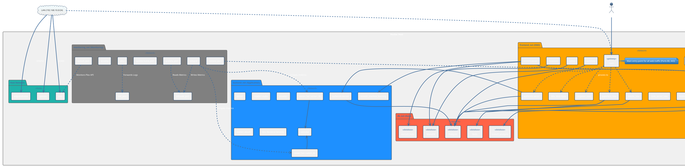

```plantuml
@startuml
!theme spacelab

skinparam rectangle {
    BorderColor #304d6d
    BackgroundColor #f0f0f0
}
skinparam package {
    BorderColor #666666
}
skinparam cloud {
    BorderColor #304d6d
}

' Define actors and boundaries
actor "User / Internet" as User
cloud "LAN (192.168.10.0/24)" as LAN

rectangle "Docker Host" as Host {

    ' --- HOST NETWORK ---
    ' Containers with direct access to the host's network interface
    package "Host Network" <<Node>> #LightSeaGreen {
        rectangle "adguardhome" as adguard
        rectangle "plex" as plex
        rectangle "glances" as glances
    }

    ' --- FRONTEND NETWORK (DMZ) ---
    ' This is the primary entry point, managed by the reverse proxy
    package "frontend_net (DMZ)" <<Network>> #Orange {
        rectangle "npm" as npm <<gateway>>
        note right of npm: Main entry point for all web traffic (Ports 80, 443)

        ' User-facing applications
        rectangle "organizr_new" as organizr
        rectangle "overseerr" as overseerr
        rectangle "immich-server" as immich_server
        rectangle "paperless_new" as paperless
        rectangle "mealie_new" as mealie
        rectangle "wikijs" as wikijs
        rectangle "ollama" as ollama
        rectangle "filebrowser_new" as filebrowser
        rectangle "code_server_new" as code_server
        rectangle "firefox_new" as firefox
        rectangle "authentik-server" as authentik_server
        rectangle "whatsupdocker" as wud
        rectangle "portnote" as portnote
        rectangle "audiobookshelf" as audiobookshelf
        rectangle "calibre" as calibre
        rectangle "booklore" as booklore
        rectangle "romm" as romm
        ' ... and many others
        rectangle "Misc Web Apps" as misc_frontend
    }

    ' --- BACKEND NETWORK (Application Logic) ---
    ' Internal services that should not be directly exposed
    package "backend_net (Application)" <<Network>> #DodgerBlue {
        rectangle "sabnzbd" as sabnzbd
        rectangle "radarr_hd / radarr_4k" as radarr
        rectangle "sonarr_hd / sonarr_4k" as sonarr
        rectangle "prowlarr" as prowlarr
        rectangle "bazarr" as bazarr
        rectangle "immich_machine_learning" as immich_ml
        rectangle "authentik-worker" as authentik_worker
        rectangle "readarr-audio" as readarr_audio
        rectangle "readarr-ebook" as readarr_ebook
        rectangle "Misc Backend Services" as misc_backend
    }

    ' --- DATABASE NETWORK (Data Layer) ---
    ' The most protected network, containing databases
    package "db_net (Data)" <<Network>> #Tomato {
        rectangle "Postgres" as postgres <<database>>
        rectangle "Redis" as redis <<database>>
        rectangle "MariaDB" as mariadb <<database>>
        rectangle "immich_postgres" as immich_pg <<database>>
        rectangle "immich_redis" as immich_redis <<database>>
    }

    ' --- MONITORING NETWORK ---
    ' Services dedicated to monitoring the health of the stack
    package "monitoring_net (Monitoring)" <<Network>> #Grey {
        rectangle "grafana_port" as grafana
        rectangle "loki_port" as loki
        rectangle "alloy" as alloy
        rectangle "telegraf" as telegraf
        rectangle "influxdb_port" as influxdb
        rectangle "uptime-kuma_port" as uptime_kuma
        rectangle "tautulli_port" as tautulli
        rectangle "scrutiny" as scrutiny
        rectangle "netdata_port" as netdata
    }
}

' Define Relationships and Data Flow

' External Access
User --> npm : "HTTPS/80, 443"
LAN --> adguard : "DNS/53"
LAN --> plex : "32400"
LAN --> glances
LAN ..> npm : (Local DNS)

' Reverse Proxy Flow (Primary Path)
npm ..> organizr : "proxies to"
npm ..> paperless
npm ..> mealie
npm ..> authentik_server
npm ..> misc_frontend

' Frontend -> Backend Communication
immich_server --> immich_ml
authentik_server --> authentik_worker
radarr --> sabnzbd
sonarr --> sabnzbd

' Application -> Database Communication
paperless --> postgres
paperless --> redis
mealie --> postgres
wikijs --> postgres
authentik_server --> postgres
authentik_worker --> postgres
portnote --> postgres
booklore --> mariadb
romm --> mariadb

' Immich's self-contained backend
immich_server --> immich_pg
immich_server --> immich_redis

' Monitoring Connections
tautulli ..> plex : "Monitors Plex API"
telegraf ..> influxdb : "Writes Metrics"
grafana ..> influxdb : "Reads Metrics"
telegraf ..> radarr : "Scrapes /metrics"
telegraf ..> sonarr : "Scrapes /metrics"
alloy ..> loki : "Forwards Logs"
netdata ..> Host : "Monitors Host"

' Layout helpers
sabnzbd -[hidden]right- radarr
prowlarr -[hidden]right- sonarr

@enduml
```